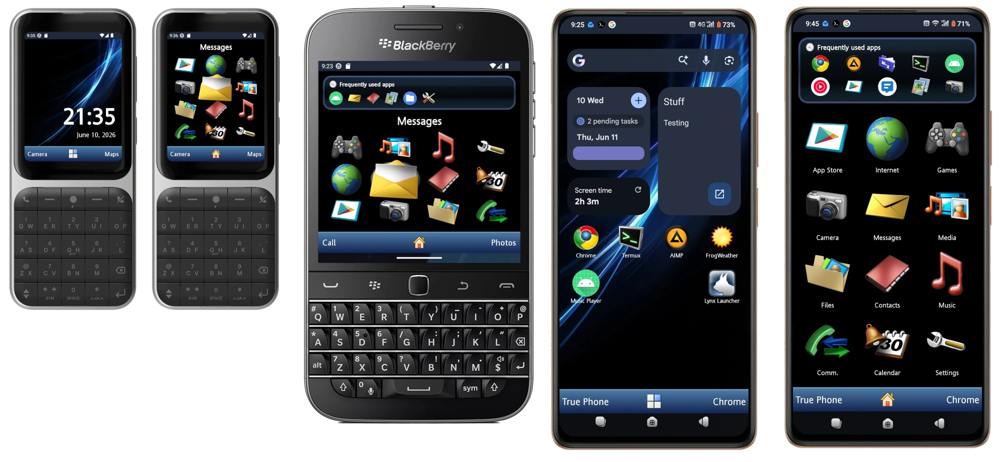

Project Mnemosyne aims to bring back the customizability and beauty of retro mobile phones to Android in the age of minimalism and corporate design.

The project overall is in its very early alpha stages at the moment.

Don't forget to check the TODO and wiki!

# Concepts
https://www.figma.com/design/TYjFxfy6Nb7WMQ72h1EK6Q/Project-Mnemosyne-Concepts

# Other Mnemosyne projects
- Music Player: https://github.com/jnk181/MnemosyneMusicPlayer
- Theme Manager: An app that will apply themes across all Mnemosyne apps. Every individual Mnemosyne app will scan for settings from this specific app and prioritize it over local-app configurations.
- Phone Dialer: An app for sending and receiving calls
- Messaging: An app for sending SMS and E-mail messages. UI should be similar to Sony Ericsson.
- Video player: An app for playing videos. It should be based on MPV.
- Photo viewer: It should be based
